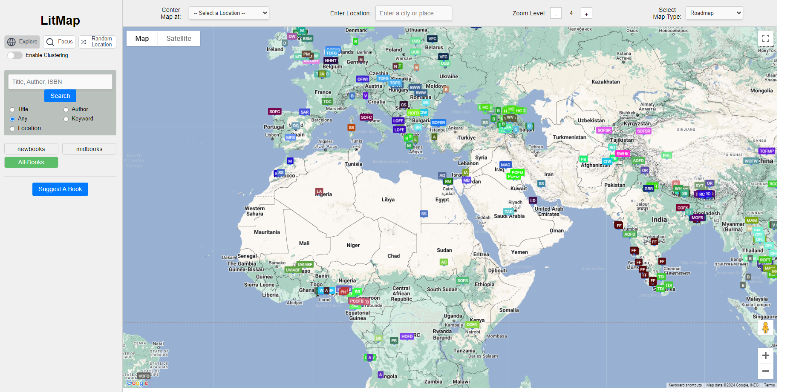
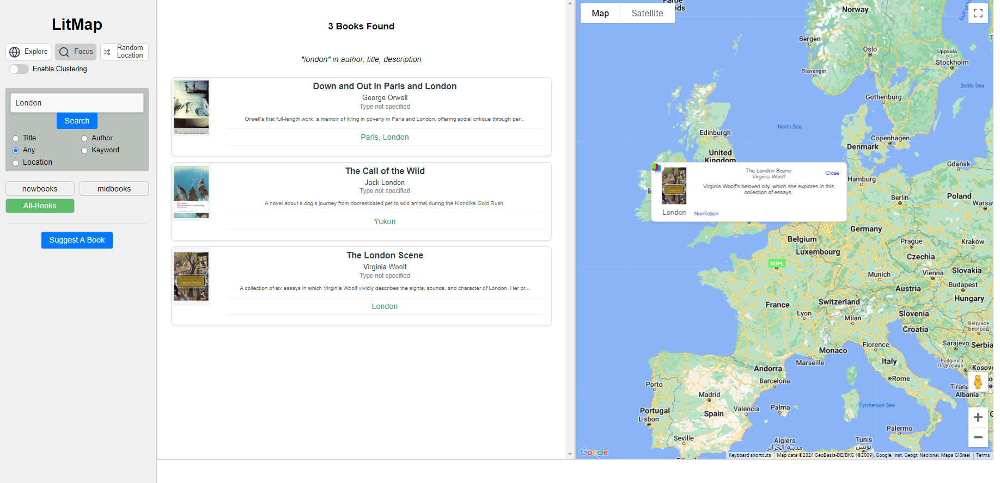

# LitMap 🌍📚

**Live App** [https://ram-n.github.io/LitMap/](https://ram-n.github.io/LitMap/)

**LitMap** is an interactive, crowd-sourced map where readers can explore and find books about real locations.
Whether you're a book lover or an adventurous traveler, LitMap is intended to show you a few books about the places you love and want to visit.

---

## 📖 What is LitMap?

LitMap is designed to bridge the gap between literature and real-life settings, giving readers and travelers another way to connect with books. Users can explore the world map to find the cities, towns, and landmarks that serve as settings in well-known (and lesser-known) books. Each location includes information about the book, author, and the setting's significance.

### Key Features

- **Global Map Exploration**: Discover settings from books worldwide on an interactive map.
- **Search & Filter**: Easily search for books by title, author, genre, and tags.
- **Contribute to the Map**: Add new books and their associated locations, making LitMap a growing repository of literary landmarks.
- **Responsive & User-Friendly**: An intuitive interface with map controls for zoom, map type selection, and quick navigation.

---

## 🛠 Tech Stack

- **Frontend**: JavaScript, Google Maps API
- **Backend**: Firebase (Firestore for data storage, Firebase Hosting)
- **Deployment**: GitHub Pages (for easy public access)

---

## 📚 Usage Guide

- **Explore the Map**: Use the map to browse locations based on books.
- **Search**: Type an author or book title into the search bar to find specific books or locations.
- **Navigation**: Switch between ‘Map,’ ‘Book List,’ and ‘Admin’ tabs for different sections of the app.

---

## 📸 Screenshots

Here's a glimpse of LitMap in action

### Map View
1. **Map View**: Explore locations around the world.

Explore global literary locations on an interactive map.

### Search and Book Details

2. **Search Functionality**: Find books by title, author, or genre.

Search for books by title or author, and see location details.

---

## 🤝 Contributing

Contributions are welcome! 
1. Suggest books that you'd like to see. These would typically be travel (or travel-related) books, travel memoirs. Any book that you feel should be included, please suggest using the "Suggest A Book" feature.

2. Please suggest feature ideas. If you wish to see something implemented, or have an idea for how something should work, please open an issue. (Or write to me!)

If you are a developer who wants to contribute:

  1. Fork the repo.
  2. Create a new branch (`git checkout -b feature/new-feature`).
  3. Make your changes and commit (`git commit -m 'Add new feature'`).
  4. Push to the branch (`git push origin feature/new-feature`).
  5. Open a Pull Request.

Please check out the issues tab if you're looking for ideas on where to start.

Also be sure to check out the [LitMap Tech Stack](tech-stack.md) page.
---

## 📋 ChangeLog

For a detailed list of changes and new features in each release, check out the [ChangeLog](./CHANGELOG.md).

--

## 🌱 Future Improvements / Roadmap

- **Enhanced Filter Options**: Add more specific filters for book types, historical eras, or themes.
- **User Profiles**: Allow users to create profiles to save favorite locations and add personalized content.
- **Book Recommendations**: Show book recommendations based on locations or user interests.

---

## 📜 License

This project is licensed under the MIT License - see the LICENSE file for details.

---

## 💬 Credits / Acknowledgments

Thanks to all contributors and the developers of Google Maps API and Firebase for providing the tools that made LitMap possible.

